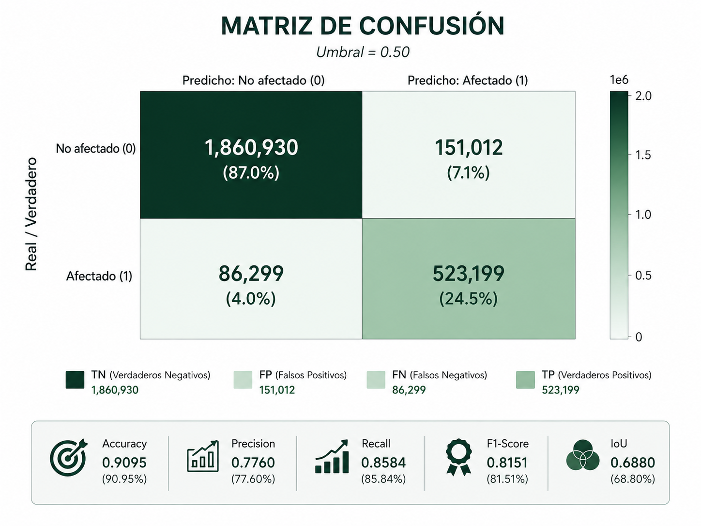
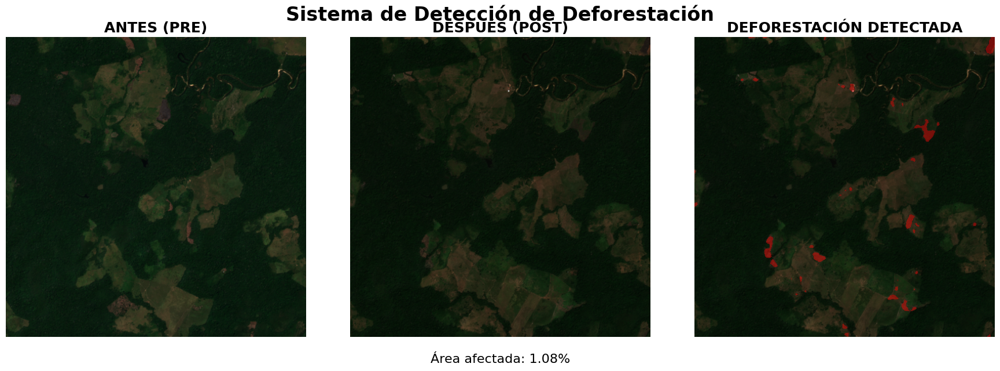

# Vision Sentinental – Detección de Cambios en Cobertura Terrestre con Deep Learning

## Descripción del proyecto

Este proyecto implementa un sistema de detección de cambios en cobertura terrestre utilizando imágenes satelitales Sentinel-2. El objetivo es identificar zonas de deforestación e incendios mediante modelos de deep learning aplicados a pares de imágenes multiespectrales PRE y POST evento.

El sistema combina técnicas de procesamiento de imágenes, extracción de características espectrales y redes neuronales convolucionales para realizar segmentación binaria de cambios a nivel de píxel.

---

## Objetivos del proyecto

- Detectar cambios en cobertura vegetal mediante imágenes satelitales
- Implementar pipelines completos de procesamiento geoespacial
- Comparar arquitecturas de segmentación semántica
- Evaluar modelos utilizando métricas estándar de computer vision
- Visualizar resultados y mapas de cambio detectado

---

## Enfoque metodológico

El pipeline del proyecto se compone de las siguientes etapas:

### 1. Preprocesamiento de imágenes satelitales

- Lectura de imágenes Sentinel-2 con `rasterio`
- Normalización de bandas espectrales
- Extracción de bandas relevantes:
  - B2 (Blue)
  - B3 (Green)
  - B4 (Red)
  - B8 (NIR)
  - B11 (SWIR1)
  - B12 (SWIR2)

- Cálculo de índices espectrales:
  - NDVI (Normalized Difference Vegetation Index)
  - NBR (Normalized Burn Ratio)
  - NDMI (Normalized Difference Moisture Index)

---

### 2. Generación del dataset

- División de imágenes en tiles (patches)
- Construcción de stacks multicanal
- Emparejamiento PRE y POST
- Generación automática de labels basados en cambios espectrales
- Construcción de dataset personalizado en PyTorch

---

### 3. Modelado

Se evaluaron tres arquitecturas principales:

- U-Net básica (baseline)
- U-Net con encoder ResNet34
- DeepLabV3+ con backbone ResNet50 (modelo final)

---

### 4. Entrenamiento

- Función de pérdida combinada:
  - Binary Cross Entropy (BCE)
  - Dice Loss

- Optimizadores:
  - Adam
  - AdamW

- Scheduler:
  - ReduceLROnPlateau

- Guardado automático del mejor modelo según pérdida de validación

---

### 5. Evaluación

Se utilizan métricas estándar para segmentación semántica:

- Accuracy
- Precision
- Recall
- F1-score
- IoU (Intersection over Union)
- Matriz de confusión

---

### 6. Visualización

El proyecto incluye visualizaciones de:

- Comparación PRE vs POST
- Predicción del modelo
- Ground truth
- Curvas de entrenamiento
- Tiles RGB
- Mapas de cambio detectado

---

## Datos

Los datos Sentinel-2 originales no se incluyen en el repositorio debido a limitaciones de tamaño de GitHub.

Para ejecutar completamente el proyecto, los datos deben colocarse dentro de:

```text
data/
```

---

## Estructura del repositorio

```text
vision_sentinental/
│
├── data/
│   ├── Pareja1_imagenes/
│   ├── Pareja2_imagenes/
│   ├── Pareja3_imagenes/
│   ├── tiles_par1/
│   ├── tiles_par2/
│   ├── tiles_par3/
│   ├── labels_par1/
│   ├── labels_par2/
│   ├── labels_par3/
│   └── stacks/
│
├── notebooks/
│   ├── 01_exploracion_datos.ipynb
│   ├── 02_unet_basico.ipynb
│   ├── 03_unet_resnet34.ipynb
│   └── 04_deeplabv3plus_final.ipynb
│
├── models/
│   └── .gitkeep
│
├── results/
│   ├── tile_example.png
│   ├── training_curve.png
│   ├── prediction_example.png
│   └── examples/
│
├── src/
│   ├── __init__.py
│   │
│   ├── datasets/
│   │   ├── __init__.py
│   │   └── dataset.py
│   │
│   ├── features/
│   │   ├── __init__.py
│   │   ├── stacks_creator.py
│   │   ├── labels_creators.py
│   │   ├── indices_calculator.py
│   │   ├── normalization.py
│   │   └── utils.py
│   │
│   ├── preprocessing/
│   │   ├── __init__.py
│   │   ├── vision_images1.py
│   │   ├── vision_images2.py
│   │   └── vision_images3.py
│   │
│   ├── models/
│   │   ├── __init__.py
│   │   ├── unet_baseline.py
│   │   ├── unet_resnet34.py
│   │   ├── deeplabv3plus.py
│   │   └── losses.py
│   │
│   ├── training/
│   │   ├── __init__.py
│   │   ├── train_unet_baseline.py
│   │   ├── train_resnet34.py
│   │   ├── train_deeplab.py
│   │   └── evaluate.py
│   │
│   └── visualization/
│       ├── __init__.py
│       ├── tile_visualization.py
│       ├── metrics_visualization.py
│       └── prediction_visualization.py
│
├── requirements.txt
├── README.md
└── .gitignore
```

---

## Instalación

Clonar el repositorio:

```bash
git clone <URL_DEL_REPOSITORIO>
cd vision_sentinental
```

---

## Crear entorno virtual

### Windows

```bash
python -m venv venv
venv\Scripts\activate
```

### Linux / Mac

```bash
python3 -m venv venv
source venv/bin/activate
```

---

## Instalar dependencias

```bash
pip install -r requirements.txt
```

---

## Entrenamiento

### DeepLabV3+ (modelo final)

```bash
python -m src.training.train_deeplab
```

### U-Net baseline

```bash
python -m src.training.train_unet_baseline
```

### U-Net + ResNet34

```bash
python -m src.training.train_resnet34
```

---

## Evaluación

```bash
python -m src.training.evaluate
```

---

## Visualización de resultados

### Curvas de entrenamiento

```bash
python -m src.visualization.metrics_visualization
```

### Predicciones del modelo

```bash
python -m src.visualization.prediction_visualization
```

### Visualización de tiles

```bash
python -m src.visualization.tile_visualization
```

---

## Modelo entrenado

Los modelos entrenados no se incluyen en el repositorio debido a limitaciones de tamaño de GitHub.

Modelo final disponible en:

[Descargar modelo_final.pth](https://drive.google.com/file/d/1YDPhQsy23dkRkNooDpIFoyzgdKZLDllJ/view?usp=drive_link)

---

## Demo rápida

El repositorio incluye tiles satelitales de ejemplo y un modelo preentrenado.

Ejecutar:

```bash
python demo.py
```

## Resultados cuantitativos

Métricas obtenidas con el modelo final DeepLabV3+ + ResNet50:

| Métrica | Valor |
|---|---|
| Accuracy | 0.91 |
| Precision | 0.77 |
| Recall | 0.85 |
| F1-Score | 0.81 |
| IoU | 0.68 |

Estas métricas muestran una buena capacidad del modelo para detectar zonas de cambio en cobertura terrestre, especialmente considerando el desbalance entre clases y la complejidad de los datos satelitales.

### Matriz de confusión



### Ejemplo de predicción

El modelo detecta automáticamente zonas afectadas mediante segmentación binaria de cambios.




### Visualización de tiles


---

## Tecnologías utilizadas

- Python
- PyTorch
- segmentation-models-pytorch
- Rasterio
- NumPy
- Matplotlib
- Scikit-learn

---

## Posibles mejoras futuras

- Incorporar datasets con labels manuales
- Añadir data augmentation
- Entrenamiento distribuido
- Optimización de hiperparámetros
- Inferencia sobre imágenes completas
- Exportación del modelo a ONNX o TorchScript
- Integración con dashboards geoespaciales

---

## Autor

Proyecto desarrollado como trabajo de investigación/aprendizaje en Deep Learning aplicado a imágenes satelitales y detección de cambios en cobertura terrestre.